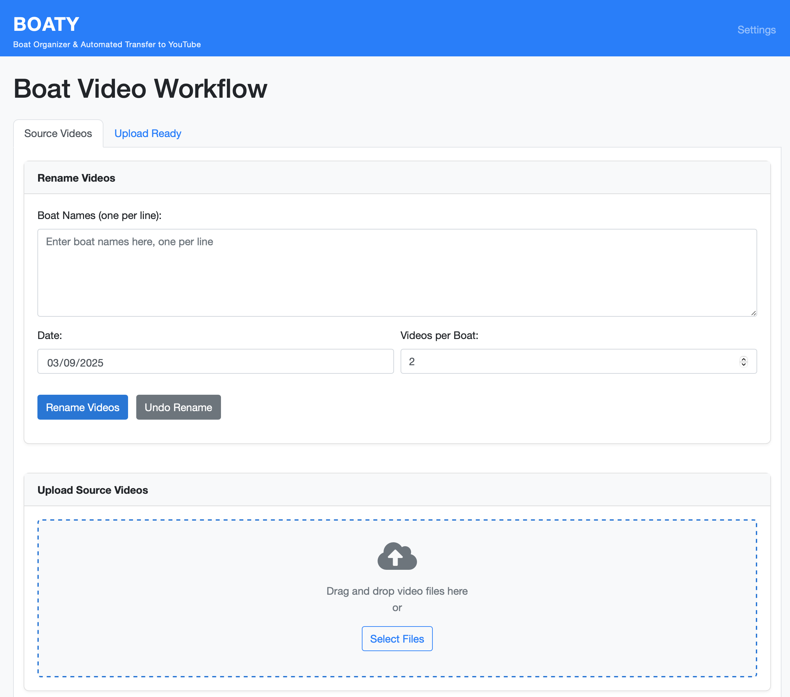
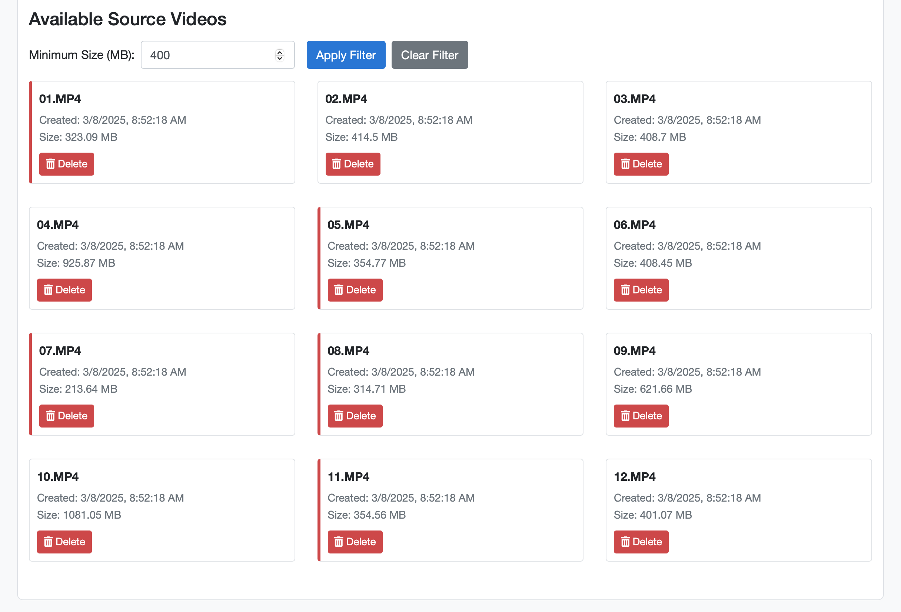
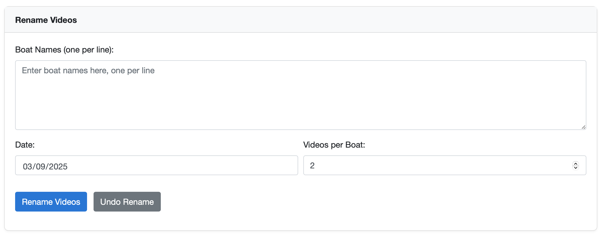
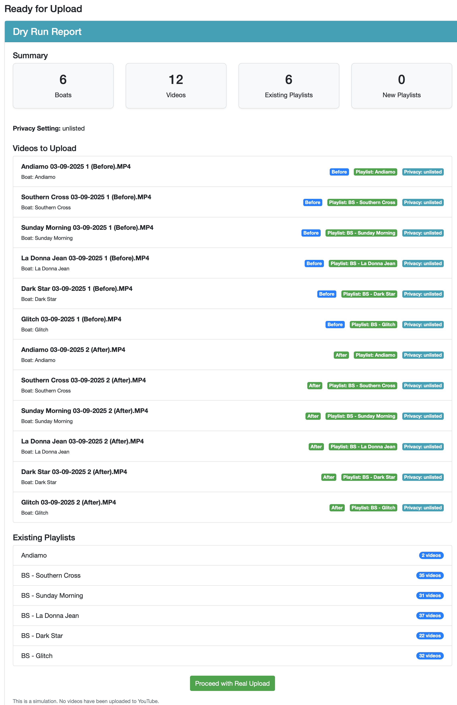
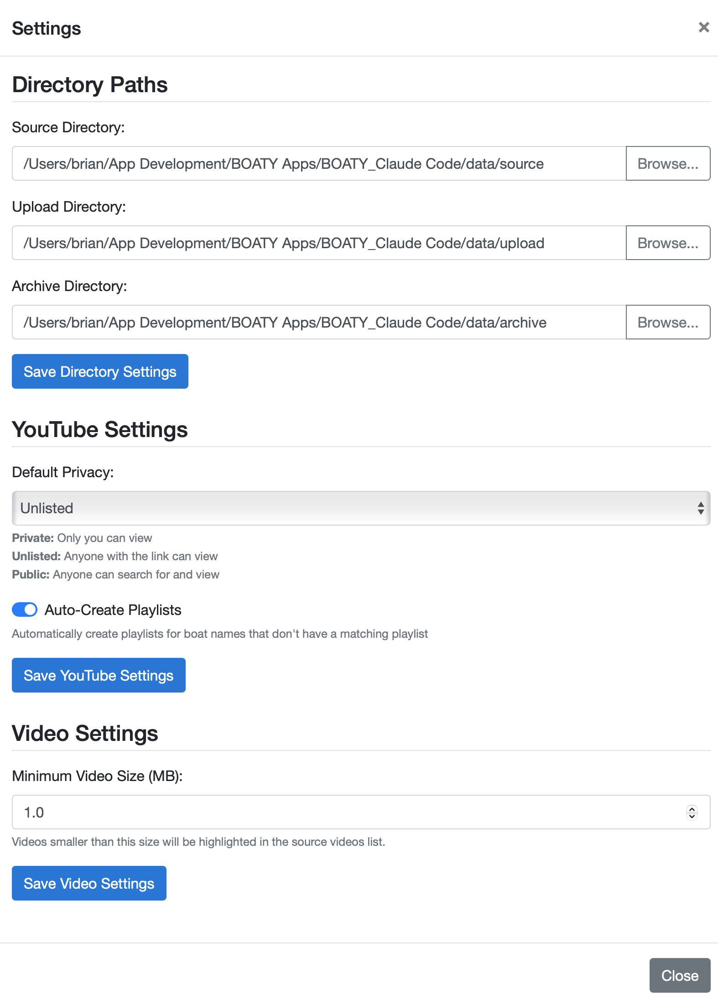

# BOATY (Boat Organizer & Automated Transfer to YouTube)

A comprehensive solution for managing the workflow of boat videos from initial capture to YouTube publication.

## Quick Start

```bash
# Clone the repository
git clone https://github.com/standardhuman/BOATY.git
cd BOATY

# Set up virtual environment
python -m venv boaty_venv
source boaty_venv/bin/activate  # On Windows: boaty_venv\Scripts\activate

# Install dependencies
pip install -r requirements.txt

# Configure your directories in config.json

# Run the application
python app.py

# Open http://localhost:5000 in your browser
```

See the full [Installation](#installation) section for detailed instructions.

## Screenshots

### Main Interface

*The main interface showing the source videos tab with drag & drop area and video list*

### Video Filtering

*Source videos with size filtering applied - small videos are highlighted with a red border*

### Rename Interface

*The rename form allowing entry of boat names and configuration of video settings*

### Upload Preview

*The upload preview showing which videos will be uploaded to YouTube*

### Settings

*Settings panel for configuring YouTube preferences and video size thresholds*

## Overview

BOATY streamlines the entire boat video workflow by combining previously separate functionalities for renaming and uploading videos into a single, unified interface. This tool makes it easier for users to process and publish their boat videos with consistent naming conventions and proper organization.

### Key Features

- **Intelligent Video Renaming**: Automatically rename videos with consistent naming conventions based on boat names and recording dates
- **YouTube Integration**: Upload videos directly to YouTube and add them to appropriate playlists
- **Automated File Management**: Move files between workflow stages automatically
- **Custom Suffix Support**: Handle multiple videos per boat with descriptive suffixes
- **Unified Web Interface**: Manage the entire workflow from a single application
- **Drag & Drop Interface**: Easily upload source videos with drag and drop
- **Size Filtering**: Filter and highlight videos that are below a certain size threshold
- **Video Management**: Delete unwanted source videos directly from the interface

## Installation

BOATY is designed to run locally on your computer, giving you full control over your video files and YouTube account.

### Prerequisites

- Python 3.6+
- Modern web browser (Chrome, Firefox, Edge, or Safari)
- YouTube account for uploading videos

### Step-by-Step Setup

1. **Clone or download the repository**:
   ```bash
   git clone https://github.com/standardhuman/BOATY.git
   cd BOATY
   ```
   Or download and extract the ZIP file from GitHub.

2. **Create a virtual environment** (recommended):
   ```bash
   # On Windows
   python -m venv boaty_venv
   boaty_venv\Scripts\activate

   # On macOS/Linux
   python3 -m venv boaty_venv
   source boaty_venv/bin/activate
   ```

3. **Install dependencies**:
   ```bash
   pip install -r requirements.txt
   ```

4. **Set up YouTube API credentials**:
   - Go to the [Google Developer Console](https://console.developers.google.com/)
   - Create a new project (e.g., "BOATY")
   - Enable the YouTube Data API v3 for your project
   - Go to "Credentials" and create OAuth 2.0 Desktop Client ID credentials
   - Download the client secrets JSON file
   - Rename it to `client_secrets.json` and place it in the BOATY project directory

5. **Configure directories in `config.json`**:
   ```json
   {
     "directories": {
       "source": "/path/to/your/source/videos",
       "upload": "/path/to/your/upload/folder",
       "archive": "/path/to/your/archive/folder"
     },
     "youtube": {
       "default_privacy": "unlisted",
       "auto_create_playlists": true
     },
     "defaults": {
       "videos_per_boat": 2
     },
     "video": {
       "min_size_mb": 1.0
     }
   }
   ```
   Replace the directory paths with folders on your computer.

6. **Run the application**:
   ```bash
   python app.py
   ```

7. **Access the web interface**:
   Open your browser and go to:
   ```
   http://localhost:5000
   ```

### First-Time YouTube Authorization

The first time you try to upload a video, you'll need to authorize the application:

1. A browser window will open asking you to sign in to your Google account
2. Grant the requested permissions to the application
3. You'll be redirected to a success page, and can then close that tab/window
4. The authorization will be saved for future sessions

### Troubleshooting

- If you see a "This app isn't verified" message, click "Advanced" and then "Go to [Project Name] (unsafe)"
- If you get errors related to the YouTube API, check that your client_secrets.json file is in the correct location
- For permission errors, make sure the directories in config.json exist and are writable

## Usage

### Basic Workflow

1. **Add source videos** - Use the drag & drop area to upload videos from your camera
2. **Filter videos** - If needed, apply size filtering to highlight short videos
3. **Enter boat information**:
   - Enter boat names in the text area (one per line)
   - Select date (defaults to today)
   - Set number of videos per boat
4. **Rename videos** - Click "Rename Videos" button
5. **Review and upload**:
   - Switch to the "Upload Ready" tab
   - Click "Preview Upload" to check what will be uploaded
   - Click "Upload to YouTube"
6. **Monitor progress** - Watch the upload progress and status indicators
7. **Videos are automatically archived** after successful upload

### Managing Source Videos

- **Upload new videos** - Drag and drop files onto the upload area
- **Delete unwanted videos** - Use the delete button on individual videos
- **Filter by size** - Set a minimum size threshold to identify short videos
- **Configure minimum size** - Set your preferred size threshold in settings

### Advanced Features

- **Custom Suffixes** - When selecting more than 2 videos per boat, customize the labels
- **Undo Rename** - Revert the last rename operation if a mistake was made
- **Dry Run** - Preview the upload process without actually uploading to YouTube
- **YouTube Integration** - Videos are automatically added to matching playlists based on boat name
- **Customizable Privacy** - Choose between private, unlisted, or public for uploads
- **Automatic Playlist Creation** - Optionally create playlists automatically for new boats

## Directory Structure

```
/Boat Video Files/
  [Raw videos directly in this folder]
  /To Upload/     - Renamed videos ready for upload
  /Archive/       - Uploaded videos organized by month
```

## Development

### Project Structure

```
boaty/
├── app.py                 # Main Flask application
├── config.json            # Configuration file
├── requirements.txt       # Python dependencies
├── static/                # Static assets
│   ├── css/               # Stylesheets
│   ├── js/                # JavaScript files
│   └── img/               # Images
├── templates/             # HTML templates
├── utils/                 # Utility modules
│   ├── file_operations.py # File handling functions
│   ├── youtube_api.py     # YouTube API integration
│   └── logging.py         # Logging functionality
└── tests/                 # Test suite
```

### Contributing

1. Fork the repository
2. Create a feature branch: `git checkout -b feature-name`
3. Commit your changes: `git commit -m 'Add some feature'`
4. Push to the branch: `git push origin feature-name`
5. Submit a pull request

## Security

- OAuth 2.0 is used for YouTube API authentication
- API credentials are stored securely
- No sensitive information is exposed in logs
- HTTPS is recommended for production deployment

## License

This project is licensed under the MIT License - see the LICENSE file for details.

## Acknowledgments

- Google for the YouTube Data API
- Flask team for the web framework
- Bootstrap team for the frontend framework 