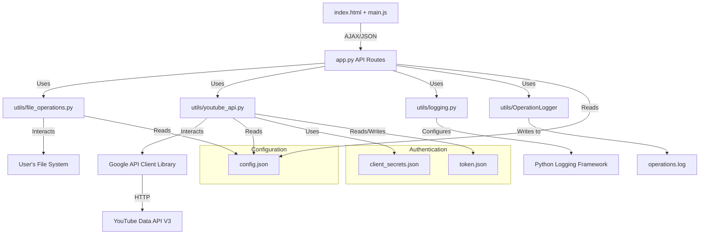

# System Patterns: BOATY

## Core Architecture
- **Flask Backend:** Python Flask app (`app.py`) serves as the backend, handling API requests, business logic, and interaction with utility modules.
- **Vanilla JS Frontend:** The frontend is built with HTML, CSS, and vanilla JavaScript (`static/js/main.js`), interacting with the backend via AJAX/JSON API calls.
- **State Management:** Backend primarily manages application state (e.g., `upload_status`, `upload_queue`). Frontend reflects this state and triggers actions.
- **Configuration:** `config.json` stores settings for directories, YouTube API, video processing, and upload parameters.
- **Modular Utilities:** Python modules in the `utils/` directory encapsulate specific functionalities:
    - `file_operations.py`: Handles video file discovery, renaming, archiving, and deletion.
    - `youtube_api.py`: Manages all interactions with the YouTube Data API v3, including authentication, playlist management, and video uploads (resumable).
    - `logging.py`: Sets up and configures application-wide logging.
    - `OperationLogger`: Specific logger for tracking successful uploads and playlist additions (could be integrated into main logging or expanded).

## Key Technical Decisions & Patterns
- **Resumable Uploads:** `youtube_api.py` uses Google API client's resumable media upload feature for robust large file transfers.
- **Background Uploads:** Video uploads are processed in a separate thread (`threading.Thread` in `app.py`) to keep the UI responsive.
- **API-Driven UI:** The frontend relies heavily on API calls to the Flask backend to fetch data and trigger actions.
- **Global Status Object:** `upload_status` dictionary in `app.py` acts as a central global state for tracking ongoing uploads, polled by the frontend.
    - **Initialization Fix:** Critical `KeyError` was resolved by ensuring this dictionary is fully re-initialized with all expected keys (including `'paused'`, `'completed_uploads'`, etc.) at the start of an upload batch (`/api/upload-videos`) and when cleared (`/api/clear-upload-status`).
- **Throttling:** `youtube_api.py` includes logic to throttle upload speed based on settings in `config.json`. This was refined to calculate rates based on bytes uploaded in the most recent interval for accuracy.
- **Logging Strategy:**
    - Centralized setup in `utils/logging.py` using Python's `logging` module.
    - Default level is `INFO`, capturing key application events, errors, and warnings.
    - Detailed, frequent logs (e.g., per-chunk upload progress, internal callback updates, throttling calculations) are set to `DEBUG` level to avoid excessive console output during normal operation, but are available for deeper troubleshooting if the logging level is changed in `utils/logging.py`.

## Component Relationships

## Critical Implementation Paths
1.  **Video Renaming Workflow:** User selects source videos -> Specifies boat names, date -> Backend renames files in `upload/` -> UI updates.
2.  **Video Upload Workflow:** User confirms renamed videos -> Initiates upload -> Backend queues videos -> `process_upload_queue` thread iterates:
    - `youtube_api.upload_video` handles each file: authenticates, sends resumable chunks, calls progress callback.
    - `app.py`'s `update_progress_callback` updates global `upload_status`.
    - Frontend polls `/api/upload-status` to display progress.
    - Successful uploads are archived, source files potentially deleted.
3.  **Authentication:** `youtube_api.py` handles OAuth2 flow via `google-auth-oauthlib`, storing `token.json`.

## Design Patterns
- Dependency injection for testability and modularity
- Repository pattern for data access abstraction
- Observer pattern for event-driven features
- Adapter pattern for third-party API integrations

## Component Relationships
- Clear separation between core modules, utilities, and integrations
- Well-defined interfaces for communication between components
- Logging and monitoring as cross-cutting concerns

## Critical Implementation Paths
- Authentication and authorization flows
- API request/response validation and error handling
- Data synchronization and consistency mechanisms
- Extensible plugin/integration system 